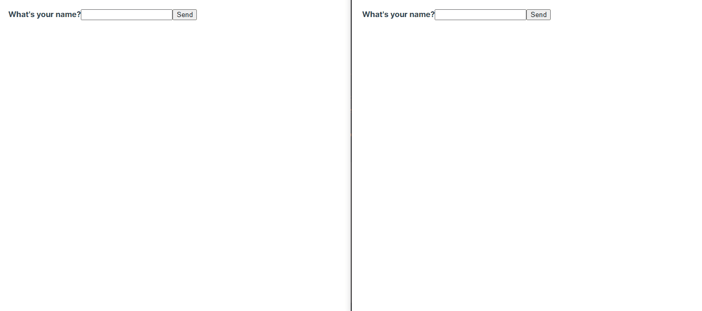

<section align="center">
    <h1>WEBSOCKET CHAT</h1>
</section>

---

<h2 align="center">Summary</h2>

    <a href="#about">📙 About</a>
    <a href="#preview">🖼️ Preview</a>
    <a href="#technologies">💻 Technologies</a>

<h4 align="center">
   ✔️ Websocket Chat finished ✔️
</h4>

<H2 id="about">📙 About</H2>

Websocket Chat is a simple application used to study real-time websocket communication. It uses a client to simulate a conversation between even more than two people on a chat.

Application created by Marius Espejo and executed by <a href="https://www.linkedin.com/in/kleverson-kenji-iwatani/">Kenji Iwatani</a>

---

<H2 id="preview">🖼️ Preview</H2>

<section align="center">
    
</section>

---

<H2 id="technologies">💻 Technologies</H2>

- [x] <a href="https://vuejs.org/">VueJS</a>
- [x] <a href="https://nestjs.com/">NestJS</a>
- [x] <a href="https://socket.io/">Socket.IO</a>